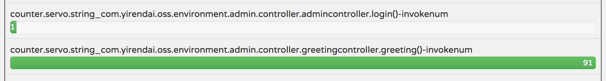

# 自定义spring boot metrics度量信息
有时候我们需要实时监控一个方法的被调用次数和执行时间，spring boot actuator提供了`CounterService`，`GaugeService`两个接口帮助我们进行metrics数据的搜集。netflix
提供了这两个接口的实现类，本文通过使用netflix的工具类，进行spring boot metrics度量信息的扩展。
## 方法
使用spring aop可以很方便采集方法调用次数以及方法的执行时间。
### 调用次数采集--使用`CounterService`
> 注意事项: 方法increment()的第一个参数要添加前缀`"meter."`。参考`ServoMetricServices`的实现逻辑。

      @Before("execution(* cn.home1.oss.environment.admin.controller.*.*(..))")
      public void countServiceInvoke(JoinPoint joinPoint) {
        this.counterService.increment("meter." + joinPoint.getSignature() + "-invokeNum");
      }
      
spring boot admin接口调用次数展示：

### 方法执行时间采集--使用`GaugeService`
netflix支持接口的多种数据统计，配置方法稍微不同，spring boot admin当前只支持最基本的数据统计展示。
#### 最近一次接口响应时间
默认收集最近一次接口的响应时间，配置为：

    @Around("execution(* cn.home1.oss.environment.admin.controller.*.*(..))")
    public Object latencyService(ProceedingJoinPoint proceedingJoinPoint) throws Throwable {
      long start = System.currentTimeMillis();
      Object proceed = proceedingJoinPoint.proceed();
      long end = System.currentTimeMillis();
      this.gaugeService.submit(proceedingJoinPoint.getSignature().toString() + "-invokeTime", end - start);
      return proceed;
    }
#### 历史接口响应时间统计

添加`"timer."`前缀，支持接口最大请求时间、最小请求时间等统计，目前只能通过请求`/metrics`查看，spring boot admin metrics tab页面目前不支持该统计数据的查看。

    this.gaugeService.submit("timer." + proceedingJoinPoint.getSignature().toString() + "-invokeTime", end - start);
统计结果实例：

    "counter.servo.string_cn.home1.oss.environment.admin.controller.greetingcontroller.greeting()-invokenum": 101,
    "normalized.servo.string_cn.home1.oss.environment.admin.controller.greetingcontroller.greeting()-invoketime.totaltime": 1688.8166666666666,
    "normalized.servo.string_cn.home1.oss.environment.admin.controller.greetingcontroller.greeting()-invoketime.count": 1.6833333333333333,
    "gauge.servo.string_cn.home1.oss.environment.admin.controller.greetingcontroller.greeting()-invoketime.min": 1002,
    "gauge.servo.string_cn.home1.oss.environment.admin.controller.greetingcontroller.greeting()-invoketime.max": 1011
## 总结
通过spring aop可以很容易的配置spring mvc接口和RESTful接口的被调用次数和接口的执行时间。统计配置类的完整代码：

    @Aspect
    @Component
    public class ServiceMonitor {
    
      private final CounterService counterService;
    
      private final GaugeService gaugeService;
    
      public ServiceMonitor(CounterService counterService, GaugeService gaugeService) {
        this.counterService = counterService;
        this.gaugeService = gaugeService;
      }
    
      @Autowired
      public ServiceMonitor serviceMonitor(final CounterService counterService, final GaugeService gaugeService) {
        return new ServiceMonitor(counterService, gaugeService);
      }
    
      @Before("execution(* cn.home1.oss.environment.admin.controller.*.*(..))")
      public void countServiceInvoke(JoinPoint joinPoint) {
        this.counterService.increment("meter." + joinPoint.getSignature() + "-invokeNum");
      }
    
      @Around("execution(* cn.home1.oss.environment.admin.controller.*.*(..))")
      public Object latencyService(ProceedingJoinPoint proceedingJoinPoint) throws Throwable {
        long start = System.currentTimeMillis();
        Object proceed = proceedingJoinPoint.proceed();
        long end = System.currentTimeMillis();
        this.gaugeService.submit("timer." + proceedingJoinPoint.getSignature().toString() + "-invokeTime", end - start);
        return proceed;
      }
      
## 参考文档
[自定义spring boot度量信息](http://www.jianshu.com/p/e20a5f42a395, "自定义spring boot度量信息")
